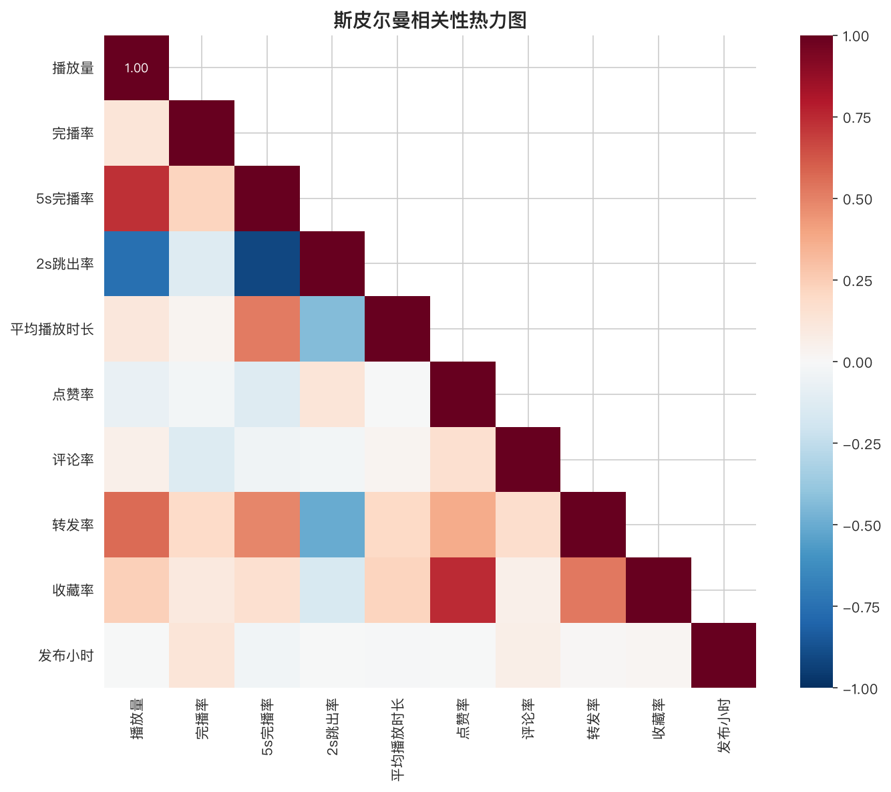
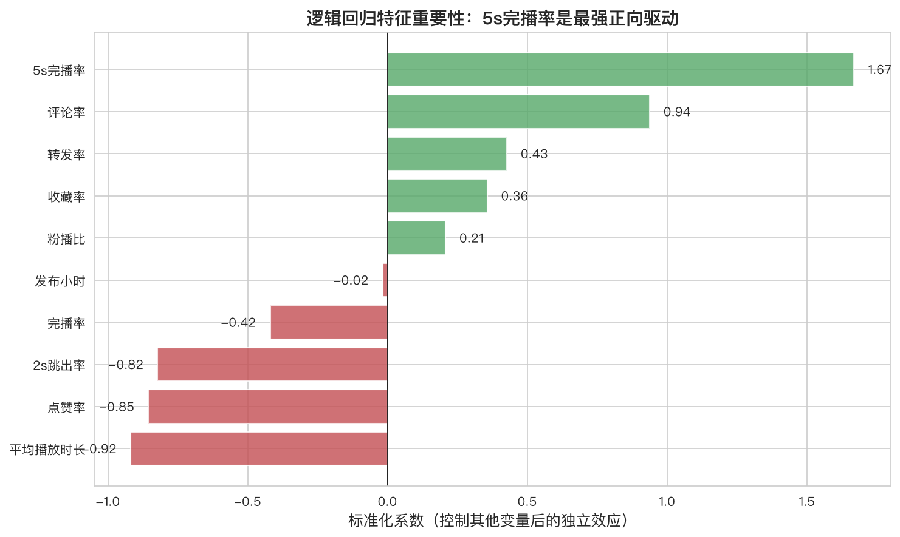

# 抖音短视频爆款驱动因素分析

> 基于个人抖音账号 **207 条真实视频**，用数据复盘爆款与普通视频的差异，识别成为爆款的关键因素，并输出可落地的选题与内容制作策略。


---

## 一、项目背景

在短视频运营中，“什么样的视频会爆”往往依赖经验和直觉。本项目以个人抖音账号 **2026-03-13 至 2026-09-27** 发布的 207 条视频为样本，通过数据分析回答三个问题：

1. 爆款视频和普通视频到底差在哪？
2. 哪些因素与“成为爆款”显著相关？
3. 后续选题和制作应该优先做什么、避免什么？

## 二、数据集说明

- **数据来源**：抖音创作者后台导出的视频数据，共 16 个原始字段
- **样本规模**：207 条视频（全部公开、播放量 > 0）
- **核心字段**：播放量、完播率、5s 完播率、2s 跳出率、封面点击率、平均播放时长、点赞 / 评论 / 分享 / 收藏量、粉丝增量等
- **隐私处理**：公开仓库中移除了作品名称、精确发布时间等可识别信息，仅保留建模所需的脱敏数据（见 `data/douyin_cleaned_anonymized.csv`），并新增 `是否爆款` 标签

> ⚠️ 封面点击率有 117 条（56.5%）为缺失，因此该指标仅作辅助分析，未纳入建模。

## 三、分析框架：先留人，后转化

依据抖音创作者后台的指标体系，将核心指标拆成两个阶段：

| 阶段 | 指标 | 回答的问题 |
|---|---|---|
| **留人阶段** | 完播率、5s 完播率、2s 跳出率、封面点击率、平均播放时长 | 用户能不能被留住？ |
| **转化阶段** | 点赞率、评论率、转发率、收藏率、粉播比 | 用户愿不愿意互动？ |

## 四、分析方法

考虑到播放量呈**长尾右偏分布、爆款与普通样本不均（42 vs 165）**，没有直接套用默认的均值 / 线性方法，而是：

1. **数据清洗与特征工程**：处理 `-` 缺失值、统一数值格式，衍生点赞率 / 评论率 / 转发率 / 收藏率 / 粉播比，提取发布时段等时间特征
2. **斯皮尔曼相关性分析**：不要求正态分布，稳健衡量各指标与播放量的单调关系
3. **曼-惠特尼 U 检验**：非参数检验，判断爆款组与普通组的差异是真实存在还是偶然巧合
4. **逻辑回归建模**：控制其他变量，分离每个因素的“独立净效应”，并用 5 折交叉验证评估
5. **系数 p 值检验 + 多重共线性诊断（VIF）**：判断系数可信度，识别高度重合的冗余指标，避免重复归因

## 五、核心发现

**模型 5 折交叉验证准确率 85%**，关键结论按证据强度排序：

### 1. 前 5 秒留存是第一驱动（而非整体完播率）
5s 完播率是**唯一在所有方法中都显著**的因素：爆款组 50.5% vs 普通组 38.8%（高 30%），相关性 r=0.734、p<0.001。而整体完播率两组几乎无差异（0.99 倍，p=0.454）——用户不需要看完，前 5 秒留住即可。

### 2. 短视频更易爆
1 分钟以内视频爆款率 **24.2%** 最高，5 分钟以上仅 16.3%；控制其他变量后，时长的净效应显著为负（p<0.001）。

### 3. 转发是破圈放大器，评论是“留人达标后”的条件助推
- 转发率 r=0.563、p<0.001，爆款组比普通组高 68%，是综合质量的强信号
- 评论率单看并不显著，但控制留人等变量后净效应显著为正（p=0.003）：先留得住人，评论多才进一步助推爆款

### 4. 点赞率显著为负，修正经验认知
爆款组点赞率反而更低（0.85 倍，p=0.014）——高点赞率多为“精准小圈层”视频，难以破圈。

### 5. 识别冗余指标，避免重复计算
5s 完播率与 2s 跳出率相关性高达 **r=−0.91**（VIF 6.5 / 5.7 偏高），二者是“留人”这一个维度的两个观测点，并非两个独立因素。





## 六、落地策略

按优先级输出可执行、可量化的内容策略：

| 优先级 | 策略 | 量化目标 |
|---|---|---|
| ★★★ | 前 2 秒制造冲突 / 悬念，前 5 秒抛出核心价值 | 5s 完播率提升至 50%+ |
| ★★★ | 时长控制在 1 分钟以内，减少 5 分钟以上长视频 | 爆款率提升至 24%+ |
| ★★☆ | 设计转发钩子（如实用清单、@好友） | 转发率提升至 0.7%+ |
| ★★☆ | 结尾留开放性 / 争议性观点引导评论（须先保证留人） | 评论率提升至 0.25%+ |
| ★☆☆ | 固定上午（6–12 点）发布 | 提高初始流量通过率 |
| 避免 | 不刻意追求高完播率、高点赞 | 避免策略走偏 |

## 七、项目结构

```
douyin-viral-analysis/
├── README.md                         # 项目说明（本文件）
├── requirements.txt                  # 依赖库
├── .gitignore
├── notebooks/
│   └── douyin_viral_analysis.ipynb    # 完整分析 Notebook（可逐格运行）
├── data/
│   └── douyin_cleaned_anonymized.csv # 脱敏后的可复现数据（207 条）
└── figures/                          # 8 张分析图表
    ├── fig1_play_distribution.png
    ├── fig2_retention_comparison.png
    ├── fig3_conversion_comparison.png
    ├── fig4_genre_viral_rate.png
    ├── fig5_time_viral_rate.png
    ├── fig6_correlation_heatmap.png
    ├── fig7_logistic_coefficients.png
    └── fig8_collinearity_heatmap.png
```

## 八、快速开始

```bash
# 1. 克隆仓库
git clone https://github.com/ziyuye73-jpg/douyin-viral-analysis.git
cd douyin-viral-analysis

# 2. 安装依赖（建议 Python 3.11）
pip install -r requirements.txt

# 3. 启动 Jupyter，按顺序运行 notebooks/douyin_viral_analysis.ipynb
jupyter notebook
```

> Notebook 默认读取创作者后台导出的原始 Excel；如需直接用脱敏数据复现建模部分，可将 `data/douyin_cleaned_anonymized.csv` 读入后从对应单元格开始运行。

## 九、技术栈

`Python` · `pandas` · `NumPy` · `SciPy` · `scikit-learn` · `statsmodels` · `Matplotlib` · `Seaborn` · `Jupyter`

## 十、局限性说明

- **观察数据、相关非因果**：本项目为回溯性观察分析，无法完全排除话题热度、发布时机等未观测因素的影响，策略建议基于相关性，后续可用 A/B 测试验证严格因果
- **单账号、样本量有限**：结论适用于本账号，跨账号通用性需进一步验证；凌晨时段仅 4 条样本，未纳入比较
- **未做内容主题分析**：若数据包含话题 / 标签字段，可进一步分析“什么主题更易爆”

---

<sub>本项目为个人学习与实战复盘，公开数据已脱敏，仅供学习交流。</sub>
